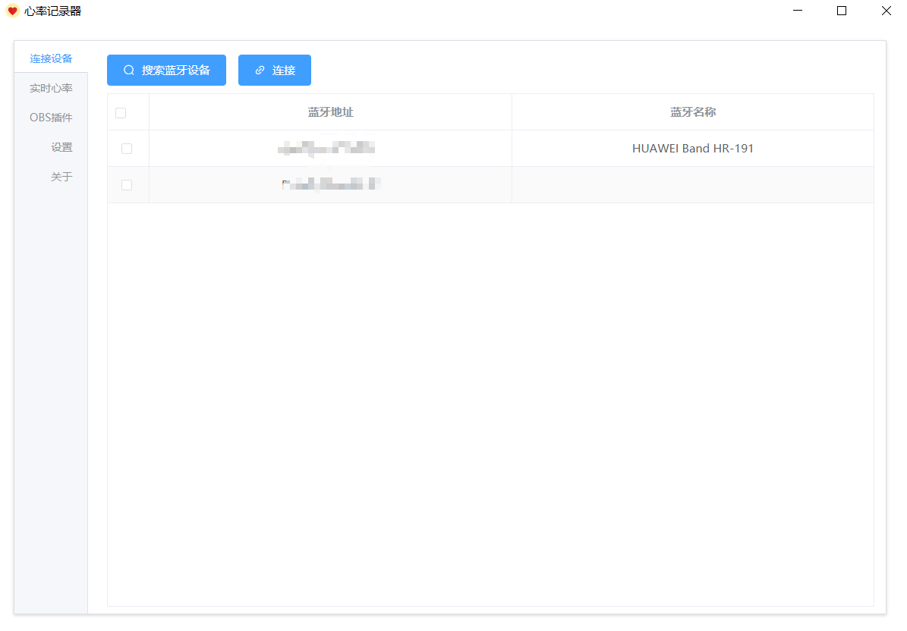
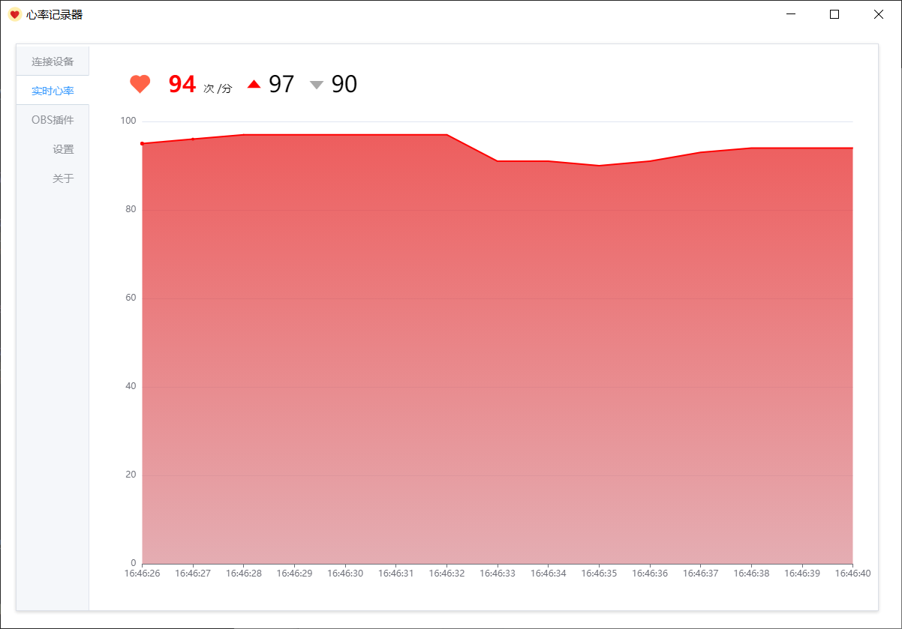
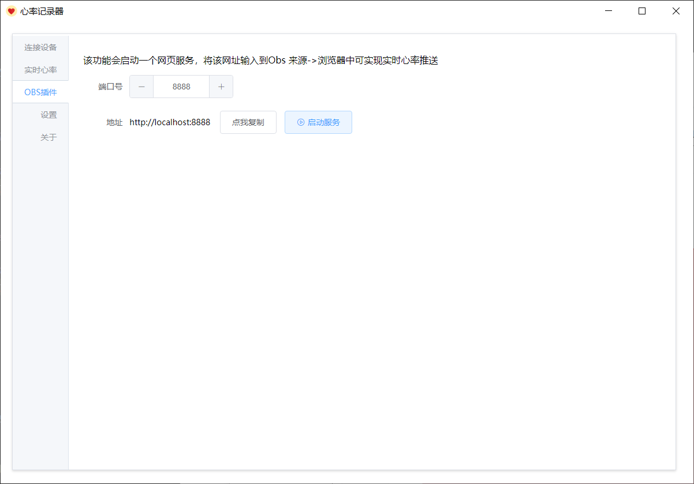
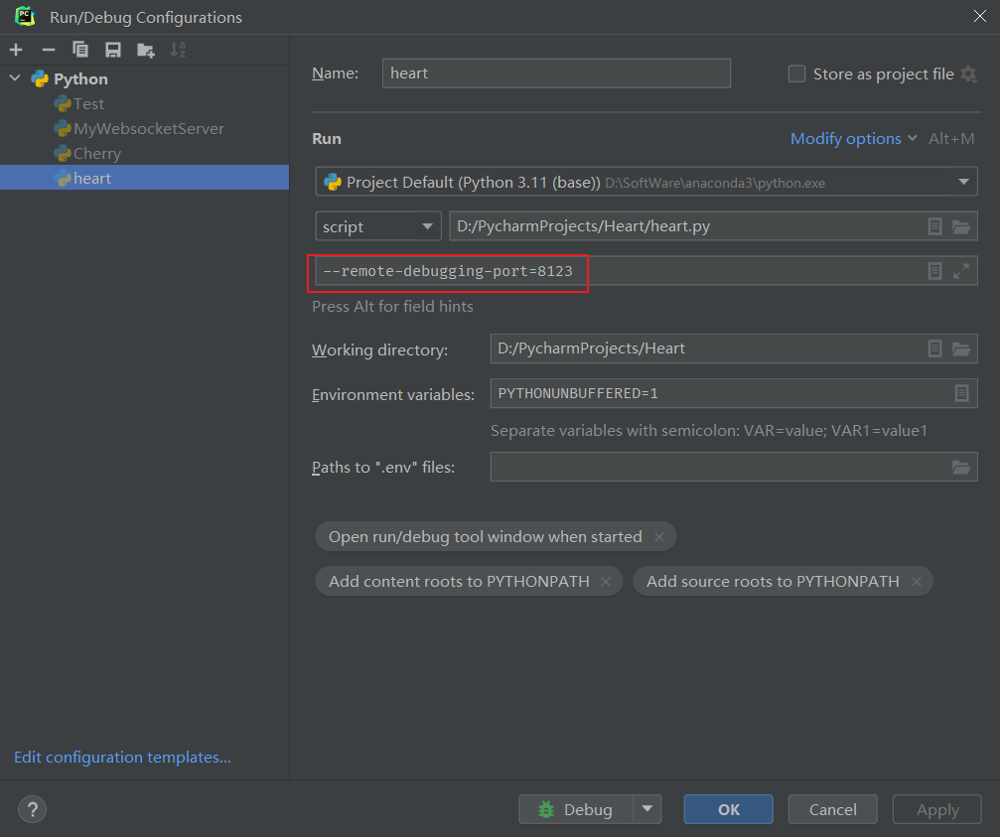

# 基于PyQT5且可以用于OBS直播推流显示心率的心率记录软件








## 使用方法

1.下载压缩包，解压软件，双击 heart.exe 就可以打开软件。

2.先打开运动手环、运动手表（支持心率广播功能）的心率广播功能，本人演示用的是华为手环8。

3.点击 "搜索蓝牙设备" 按钮，搜索附近蓝牙设备信息，找到自己的设备蓝牙，点击连接。

4.连接设备成功后，点击左侧边栏 "实时心率" 即可查看当前自己心率（由左到右依次是，最新值，最大值，最小值）


## 软件架构

基于PyQt5 的webEnginer功能，用 vue + elementUI 做前端，后端服务用的是Python.

前端和后端的通信，用的是 qwebchannel.js

蓝牙库 bleak


## 开发调试

在运行参数后面加上 参数，本地通过浏览器即可显示js运行的日志

```js
--remote-debugging-port=8123
```




python3 pyqt5-html5-demo.py --remote-debugging-port=8123


## 软件打包

用的是cx_Freeze 打包，打包成压缩包。直接双击heart.exe就可以运行，不用配置环境。

#### build方式打包成exe文件，可以脱离python环境运行

```python
python setup.py build
```

#### bdist_msi方式可以打包成windows下msi格式的安装包文件

```python
python setup.py bdist_msi  
```


cx_Freeze 的版本不宜太高，经测试 
    7.2.3 编译失败
    7.2.0 7.1.1 编译成功，运行软件时，html页面没有渲染出来。


## 其他依赖版本

* echarts 5.5.1
* sql.js 1.5.0

## 生成requirements.txt


pipreqs 可以通过扫描项目目录，帮助我们仅生成当前项目的依赖清单。

通过以下命令安装：

```python
pip install pipreqs
```


运行：

```python
pipreqs ./
```


